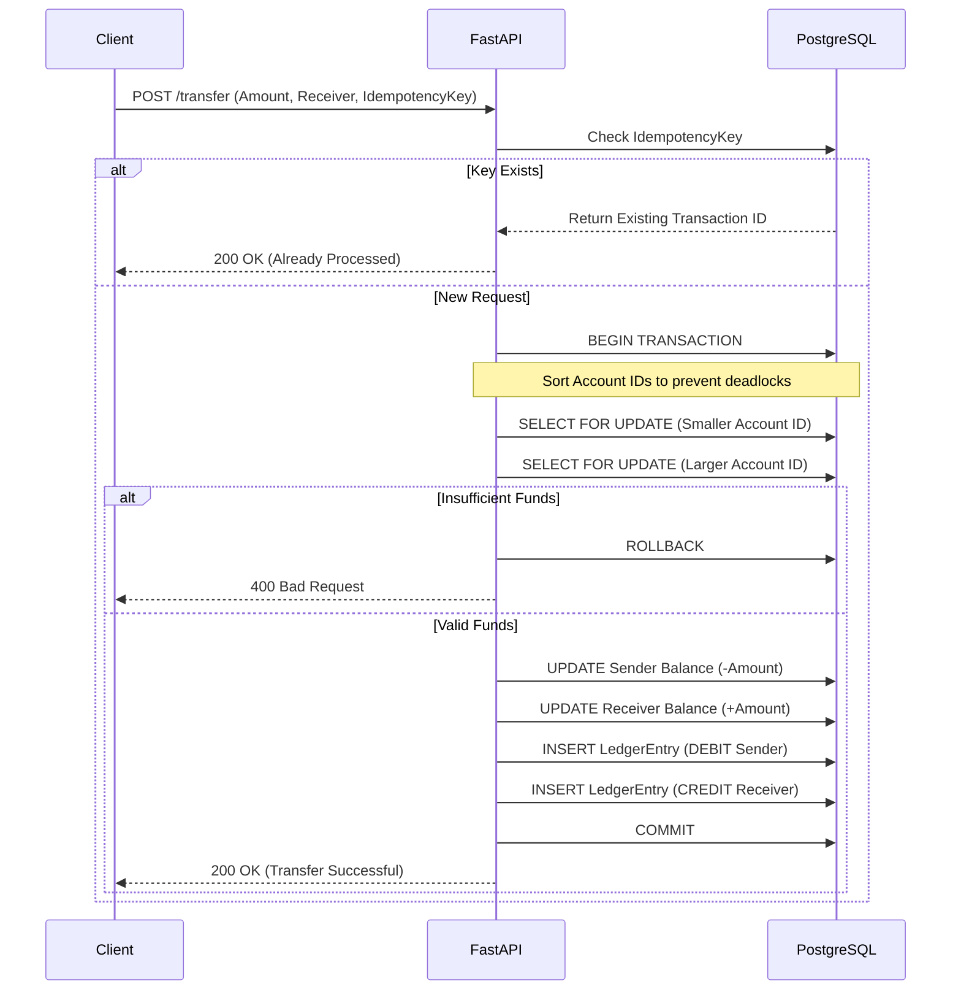
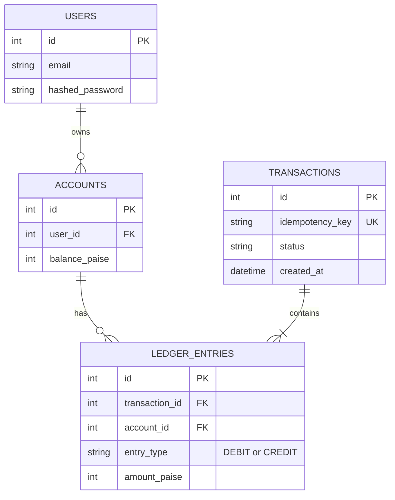

<div align="center">

#  LedgerCore
**ACID-Compliant Core Banking API**


A production-grade REST API simulating a core banking backend. LedgerCore handles secure user authentication, account management, and concurrent money transfers with financial-grade data integrity.

</div>

---

##  Key Features

* ** Double-Entry Ledger** — Every financial movement creates immutable `DEBIT` and `CREDIT` records, ensuring a non-repudiable audit trail.
* ** ACID Transactions** — Transfer operations are wrapped in atomic transaction blocks. If any step fails (e.g., validation, server crash), the entire operation rolls back.
* ** Concurrency Safe (Row-Level Locking)** — Utilizes `SELECT ... FOR UPDATE` with ordered ID locking to prevent race conditions (double-spending) and deadlocks during simultaneous transfers.
* ** Integer Currency Handling** — All balances are stored as integers (paise/cents) rather than floats to eliminate floating-point precision errors.
* ** Idempotency** — API supports `idempotency_key` checks on transfers, preventing duplicate transactions if a client retries a network request.
* ** JWT Authentication** — Secure stateless authentication routing ensuring users can only interact with their own accounts.

---

##  System Architecture

The system is designed to handle concurrent transaction requests safely, ensuring no two requests can modify the same account balance simultaneously without waiting in a secure queue.



---

##  Project Structure

```text
LedgerCore/
├── app/
│   ├── main.py              # FastAPI application setup & routing
│   ├── models.py            # SQLAlchemy ORM models (Users, Accounts, Ledger)
│   ├── database.py          # PostgreSQL connection & session management
│   ├── auth.py              # JWT hashing & token verification logic
│   └── schemas.py           # Pydantic models for request/response validation
├── tests/
│   ├── conftest.py          # Pytest fixtures (DB setup/teardown for tests)
│   ├── test_auth.py         # Unit tests for registration and login
│   └── test_transfers.py    # Concurrency, insufficient funds, & idempotency tests
├── docker-compose.yml       # Multi-container orchestration (API + Postgres)
├── Dockerfile               # API image build instructions
├── requirements.txt         # Python dependencies
└── README.md                # Project documentation
```

---

##  Database Schema

The schema is heavily normalized and designed for high financial integrity.



---

##  Local Setup (Docker)

The easiest way to run LedgerCore is via Docker, which automatically spins up the FastAPI server alongside a fully configured PostgreSQL database.

**1. Clone the repository**
```bash
git clone https://github.com/Arshpreet-Singh-2005/LedgerCore.git
cd LedgerCore
```

**2. Build and start the containers**
```bash
docker compose up --build
```
*The API is now running at `http://localhost:8000`.*

---

##  Running the Test Suite

LedgerCore includes a comprehensive Pytest suite validating edge cases like insufficient funds, invalid account routing, and idempotency locks.

```bash
# Run tests with verbose output
pytest tests/ -v
```

---

##  API Reference

Interactive Swagger UI documentation is available at `http://localhost:8000/docs` when the server is running.

### Transfer Funds
`POST /transfer/`

Executes a secure, ACID-compliant transfer between two accounts.

**Request Body:**
```json
{
  "sender_account_id": 1,
  "receiver_account_id": 2,
  "amount_paise": 5000,
  "idempotency_key": "req-987-xyz"
}
```

**Success Response (200 OK):**
```json
{
  "message": "Transfer successful",
  "transaction_id": 42
}
```

**Error Response (400 Bad Request - Insufficient Funds):**
```json
{
  "detail": "Insufficient funds"
}
```

---

##  Author

**Arshpreet Singh**
*  **LinkedIn:** [linkedin.com/in/arshpreet-singh-56089531a](https://linkedin.com/in/arshpreet-singh-56089531a)
*  **GitHub:** [github.com/Arshpreet-Singh-2005](https://github.com/Arshpreet-Singh-2005)
*  **Email:** sarshpreet653@gmail.com
